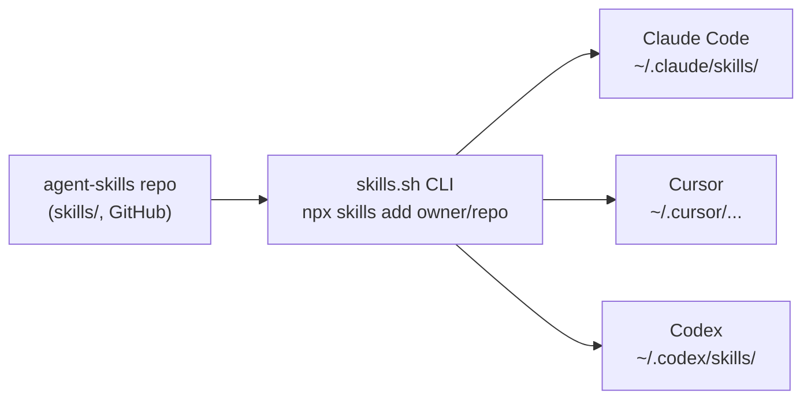

# Personal Skills Repo Setup

## Summary

Establish `agent-skills` as a personal, single-source skills repository modeled
on `vercel-labs/agent-skills`, kept deliberately lean. Skills live under
`skills/`, are authored in English to one documented convention, and are
installed into every agent tool (Claude Code, Cursor, Codex) through the
skills.sh CLI rather than a hand-maintained sync script. `apple-app-design-guidelines`
is the first skill and the reference exemplar.

## Key Decisions

- **Personal use, not public distribution.** No publishing metadata, leaderboard
  ceremony, or contributor governance. The repo optimizes for the author's own
  reuse across machines and agents.
- **Install via skills.sh, not a custom script.** `npx skills add <owner/repo>`
  detects installed agents and fans one source out to all of them, so the repo
  maintains zero sync code of its own.
- **English-only authoring.** Frontmatter `description` and body are English to
  keep trigger matching and execution quality aligned with the mainstream skill
  ecosystem, even though prompts to the author's agents may be in Chinese.
- **Lean scaffolding.** Only `skills/`, `README.md`, `AGENTS.md`, and
  `.gitignore`. No template dir, validation script, CI, or LICENSE.

## Source-of-truth fan-out

## Requirements

**Repo structure**

- R1. The repo root holds `skills/`, `README.md`, `AGENTS.md`, and `.gitignore`,
  and nothing else at top level beyond `docs/`.
- R2. Each skill is a directory `skills/<kebab-name>/` containing a `SKILL.md`,
  with optional `references/` and `scripts/` subdirectories.

**Skill authoring conventions (documented in AGENTS.md)**

- R3. Every `SKILL.md` opens with YAML frontmatter carrying `name` (matching the
  directory) and a trigger-rich `description`.
- R4. Skills are written in English, frontmatter and body alike.
- R5. `SKILL.md` stays the lean entry point; bulky or optional detail moves into
  `references/*.md` loaded on demand.
- R6. `AGENTS.md` records R1–R5 so future skills, whether human- or agent-authored,
  follow one standard without re-deciding structure.

**Install and distribution**

- R7. Installation relies on the skills.sh CLI (`npx skills add <owner/repo>`);
  the repo ships no custom sync, symlink, or copy script.
- R8. `README.md` indexes the available skills and shows the one-line install
  command.

**First skill**

- R9. `apple-app-design-guidelines` remains unchanged and serves as the worked
  example of the conventions in R2–R5.

## Scope Boundaries

Explicitly not building:

- A `bin/sync` symlink/copy script (replaced by skills.sh).
- `skills.sh.json` publishing metadata or any leaderboard/marketing assets.
- A `_template/` skill scaffold or a frontmatter validation script.
- GitHub Actions CI, `LICENSE`, or a `packages/` directory.
- `CLAUDE.md` — `AGENTS.md` is the single cross-tool conventions file.

## Dependencies / Assumptions

- skills.sh auto-discovers skills under `skills/`; no in-repo manifest is needed
  for a basic `npx skills add` to work.
- The repo must be pushed to GitHub under an `owner/repo` slug for the install
  command to fetch it.
- The shared Agent Skills format (`SKILL.md` + `name`/`description` frontmatter)
  is honored by Claude Code, Cursor, and Codex via the skills.sh CLI.

## Outstanding Questions

Deferred to planning:

- The exact GitHub `owner/repo` slug to publish under (affects the README
  install command only).
- Whether `README.md` and `AGENTS.md` are authored now or generated from a first
  planning pass.
